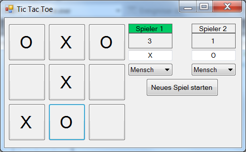

# TicTacToeFingerübung

## Allgemein

Im Folgenden wird das hier umgesetzte Tic Tac Toe Spiel etwas erläutert.<p>
  
<p>

Das Bild zeigt die grafische Oberfläche des Spiels. Abgesehen von einer Mitteilung, die am Ende einer Partie angezeigt wird, und darüber informiert, wer gewonnen hat, oder ob es ein Unentschieden gab passieren alle Interaktion des Spiels auf dieser Oberfläche.
 
Vor dem Beginn eines Spiels (durch die Betätigung des "Neues Spiel starten" Buttons) können einige Einstellungen getroffen werden. In den Textfeldern unter der Punkteanzeige der Spieler können die Spieler entweder eigene Symbole festlegen, oder die voreingestellten Zeichen "X" und "O" verwenden. Darunter kann der Spielmodus beziehungsweise die Rolle des entsprechenden Spielers, eingestellt werden. Das Spiel unterstützt für jeden Spieler die folgenden Spielmodi:

- Mensch
- KI Leicht
- KI Schwer

Bei der Einstellung "Mensch" muss der Spieler einen der Buttons des Spielfelds betätigen um dort sein Zeichen zu setzten. Der entsprechende Spieler, der aktuell am Zug ist, wird dabei grün markiert.

Bei der Einstellung "KI Leicht" wird der entsprechende Spieler vom Computer gespielt. Die leichte KI hat dabei keine Strategie, sondern wählt zufällig eines der offenen Felder aus, um dort ihr Zeichen zu setzen.

Wenn als Spielmodi die schwere KI ausgewählt wurde, wird auch dieser Spieler vom Computer gesteuert. Allerdings besitzt dieser Spielmodus eine Strategie. Die schwere KI spielt nach dem Minimax-Algorithmus. Versucht also aktiv selber zu gewinnen und den Sieg des Gegners zu verhindern.

Da für jeden Spieler ein Spielmodus ausgewählt werden kann, ermöglicht das Spiel sowohl Mensch gegen Mensch, Mensch gegen Maschine und Maschine gegen Maschine. Bei Mensch gegen Maschine ist der menschliche Spieler zudem nicht auf die Rolle des anfangenden Spielers festgelegt, sondern kann bei Bedarf auch die Rolle des 2. Spielers übernehmen.

Wurde ein Spiel gestartet, setzen die Spieler solange abwechselnd ihr Zeichen, bis es einen Gewinner oder ein Unentschieden gibt. Daraufhin werden die Punktestände entsprechend angepasst und es erscheint eine Mitteilung, in der ausgewählt werden kann, ob das aktuelle Spiel beendet oder vorgesetzt werden soll. Zusätzlich werden im Falle eines Sieges die Felder die zum Sieg geführt haben markiert.

## Aufbau

In dieser Tabelle sind alle Klassen des Programms mit einer kurzen Beschreibung aufgelistet:

|Klasse|Beschreibung|
|---|---|
|`Program`|Startet die Anwendung.|
|`Form1`|Grafische Oberfläche.|
|`SpielLogik`|Ein Objekt diese Klasse verwaltet das Spiel und kommuniziert mit der Oberfläche.|
|`SpielStatus`|Wird von der SpielLogik erzeugt und enthält alle Informationen zur aktuellen Partie. Kann von der Oberfläche verwendet werden, um das Spiel darzustellen.|
|`Koordinate`|Objekt, in dem eine Positionsangabe für das Spielbrett gespeichert werden kann.|
|`LeichteKI`|Zufällig spielende KI.|
|`SchwereKI`|Nach Minimax-Algorithmus spielende KI.|
|`KISpielbrett`| Hilfsklasse der schweren KI. Wird von der KI verwendet um die Züge zu simulieren.|
|`GewichteteKoordinate`| Hilfsklasse der schweren KI. Enthält neben der Positionsangabe noch eine Bewertung der Position als Zug.|
|`Mitteilung`| Mitteilungsfenster, das von der grafischen Oberfläche verwendet wird, um das Spielergebnis mitzuteilen.|

Die Klassen `Form1` und `Mitteilung` bilden zusammen die grafischen Komponenten der Anwendung. Der Rest ist hinter die `SpielLogik` geschaltet, ausgenommen sind die `SpielStatus` Objekte, welche von der Oberfläche verwendet werden um das Spiel anzuzeigen, aber nur von der `SpielLogik` erzeugt und verwaltet werden. Dieser Aufbau macht es möglich, das Tic Tac Toe Spiel mit einer beliebigen Oberfläche zu verbinden. Die Oberfläche benötigt lediglich ein `SpielLogik` Objekt um das Spiel zu verwalten und ein `SpielStatus` Objekt um die Ergebnisse der `SpielLogik`darin abzuspeichern. Um daraufhin mit der `SpielLogik` ein Spiel zu spielen muss die Oberfläche nur die folgenden Methoden verwenden:
```
public SpielStatus InitSpiel(SpielLogik.Spielmodi spieler1, SpielLogik.Spielmodi spieler2)
public SpielStatus MenschZug(int x, int y)
public SpielStatus KiZug()
```
Alle drei Methoden geben ein `SpielStatus` Objekt zurück, welches von der Oberfläche zum Anzeigen des Spiels verwendet werden kann.

Mittels der ersten Methode wird ein Spiel erzeugt. Die beiden Parameter entsprechen den gewählten Spielmodi für die Spieler.

Die zweite Methode wird bei einem Zug durch einen Menschen verwendet, beispielsweise beim Klicken eines Buttons auf dem Spielfeld. Sie erwartet 2 Werte, die der Position auf dem Spielbrett entsprechen. Der erste Wert ist die waagerechte Position, der zweite Wert die senkrechte Position.

Die dritte Methode besitzt keine Parameter, da sie nur dazu dient, der `SpielLogik` mitzuteilen, das jetzt eine KI ihren Zug machen kann. Falls eine KI für den Spieler der nun dran ist eingestellt wurde, wird diese ihren Zug machen.

## Die `SpielLogik` und der `SpielStatus`

Die `SpielLogik` verwaltet das Spiel. Sie hat die Aufgabe die Züge entgegenzunehmen, die KI Spieler zu verwalten und darauf zu reagieren. Das heißt, sie überprüft ebenfalls ob der gemachte Zug zulässig ist und ob es einen Sieger gibt. Das Ergebnis der Auswertung wird dann als ein `SpielStatus`Objekt an die Oberfläche zurückgegeben.

Das `SpielStatus` Objekt welches von der `SpielLogik`erzeugt wird, besitzt verschiedene Informationen, die für das Spiel und seine Darstellung notwendig sind. Beispielsweise das aktuelle Spielfeld als Array, sowie Flags zu den verschiedenen Stadien des Spiels, die von der Oberfläche abgefragt werden können. Beispielsweise ob Spieler 1 am Zug ist, ob eine KI am Zug ist, ob es ein Unentschieden gab oder wie im Falle eines Sieges die Positionen der Siegfelder sind.

## Die `SchwereKI`

Die schwere KI besteht aus insgesamt 3 Klassen. Der `SchwereKI`, der `GewichteteKoordinate` und der `KISpielbrett` Klasse. Die `SchwereKI` Klasse übernimmt dabei den Großteil der Arbeit. Sie sucht nach einem möglichst optimalen Zug, der entweder zu ihrem Sieg führt, den Sieg des Gegners verhindert oder ein Unentschieden herbeiführt, falls es keine andere Möglichkeit mehr gibt.

Die Klassen `KISpielbrett`und `GewichteteKoordinate` stellen der KI hierzu die benötigten Werkzeuge zur Verfügung. Ihr Vorgehen ist dabei wie folgt:

1. Sie wird von der `SpielLogik` mittels `public Koordinate getZug(int[,] feld, int perspektive)` dazu aufgefordert einen Zug zu machen. Dazu bekommt sie ein Array welches dem Spielfeld entspricht und eine Perspektive (Spieler 1 oder 2) als die die KI spielen soll.

2. Sie startet eine rekursive Suche nach dem besten Zug mittels `private GewichteteKoordinate MiniMax(KISpielbrett brett, int spielerNummer, int vorgeseheneSpielerNummer)`. Beim ersten Aufruf entspricht das Spielbrett dem von der `SpielLogik`übergeben Array und die anderen beiden Parameter entsprechen der übergebenen Perspektive.

3. Nun läuft die Methode über alle Felder, die noch nicht besetzt sind und macht entsprechend der `spielerNummer` dort einen Zug, simuliert also bei einer invertierten Spielernummer die Züge des Gegners.

4. Beendet der eben gemachte Zug das Spiel nicht, also kein Sieg oder Unentschieden, so ruft sich die Methode mit dem neuen Spielbrett selber wieder auf und ändert dabei aber die `spielerNummer`auf den anderen Spieler.

5. Beendet der eben gemachte Zug das Spiel, so wird dieser Zug bewertet (Die Koordinate bekommt eine Gewichtung). Ist es ein Unentschieden wird er neutral bewertet (0). Führt der Zug zu einen Sieg des Gegner (die `spielerNummer` stimmt nicht mit der `perspektive` überein) wird er negativ Bewertet (-1). Siegt der vorgesehene Spieler (`spielerNummer` und `perspektive` sind gleich) wird er Zug positiv bewertet (1).

6. Nach der Bewertung des Zuges wird geprüft, ob dies der beste Zug ist. Falls ja wird der Zug der in dieser Rekursion gemacht wurde als bester Zug an die nächst höhere Rekursion zurückgegeben. Der beste Zug wird beispielsweise dann geändert, wenn die KI in 2 Zügen siegen kann, allerdings eine andere Rekursion merkt, dass der Gegner in einem Zug siegen kann. Dann wird das Verhindern des gegnerischen Sieges dem der KI vorgezogen.
